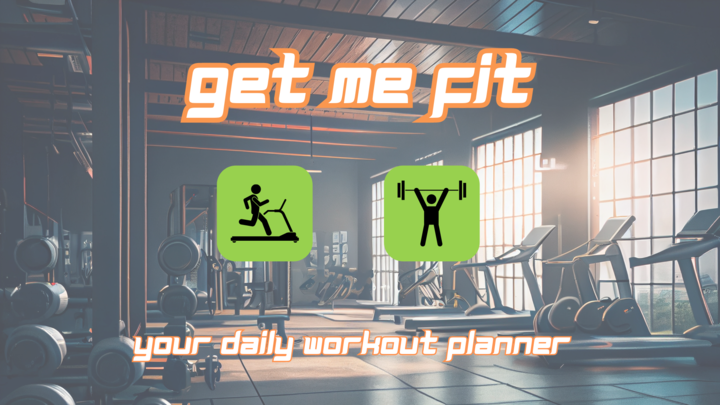
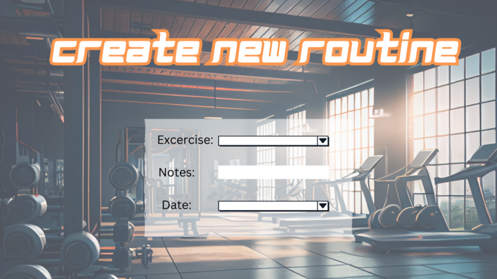
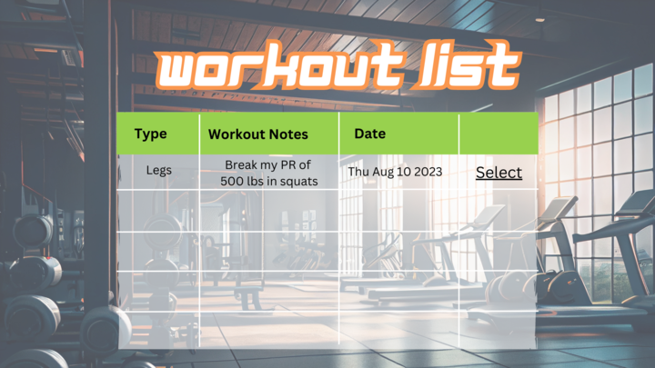
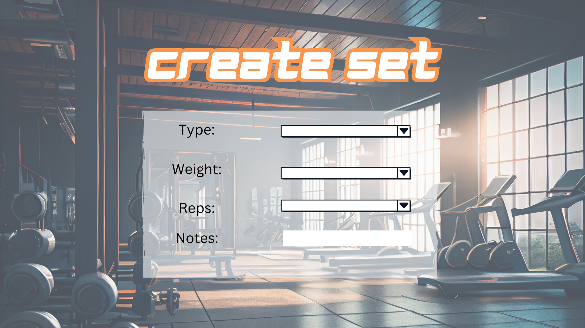

# Get Me Fit

Fitness app that allows user to record individual workouts. The user may choose between cardio or strength training workouts. The user will have the ability to customize their workouts to achieve their fitness goals.
Secondary use will be user referencing past workouts to gauge progress.

# Screenshot

# Technologies Used

- JavaScript
- HTML
- CSS
- EJS
- Express
- Node.js
- Mongoose & MongoDB
- Button Effect Provided By: https://www.codehim.com/collections/css-button-packs-with-hover-effects
- Background picture: https://www.freepik.com/free-photos-vectors/gym-background
- Delete button icon: https://fontawesome.com/
- Font: https://www.dafont.com/magz.font

# Getting Started

## Trello Board
- https://trello.com/b/q0CkniDD/p2-workflow

## App Link
- https://get-me-fit-dev-2b4dfc1e9975.herokuapp.com/

1. Open app: Home page, login to your google account, choose workout through icon images → Add Workout page
2. Input workout: date, exercise, weight, reps →  Click “Log Workout” button Workout is
3. You may also choose between all the cardio workout options with time associated with the workout.
4. Follow this template for writing your user stories; write them in order of the ‘user flow’ for your app when interacting with your application.

# Application Features

1. When user choses the strength training page they will have the ability to: 
    - choose between body parts that will be part of there exercise and the date of workout.
    - Customize each section with type, weight, reps, and notes
    - delete and edit options are available
    - users will be able to access this data for repetition of workouts and to track progress
2. When user choses the Cardio section page they will have the ability to:
    - choose between the activities of running, cycling, jump rope, swimming, treadmill, stair master, and elliptical
    - (optional)Add the time duration that goes from 15-60 minutes
    - (optional) Distance 1-5 miles
    - Add date
    - ability to access the data to update and delete if needed

    # Future Application Updates

- As a user, I would like to have a a graph that shows my progress in conjunction to the workout data.
