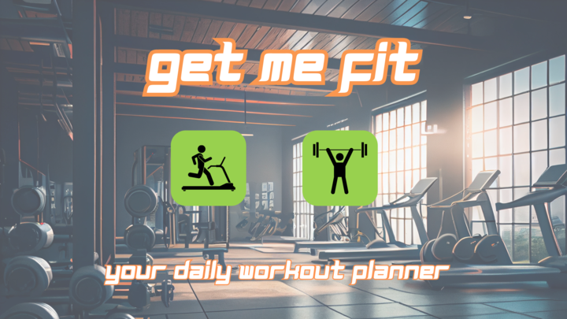
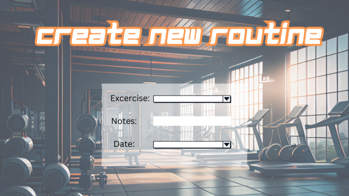
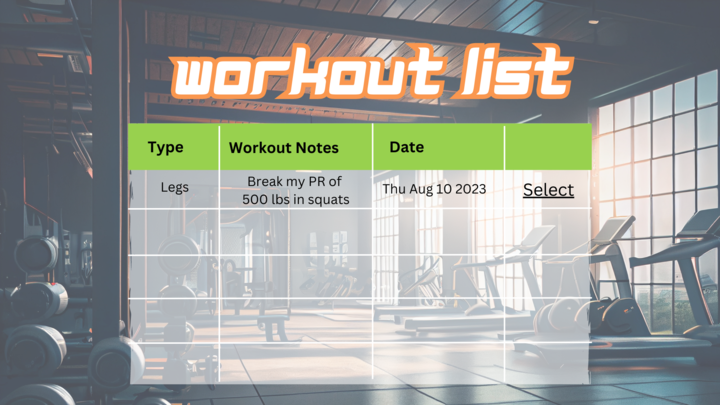
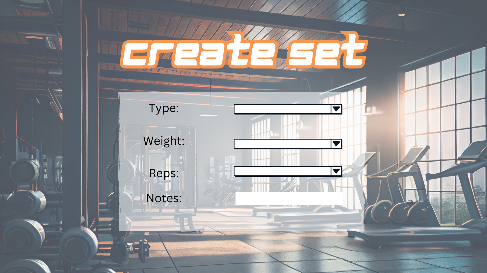

# Get Me Fit

Fitness app that allows user to record individual workouts. 
Secondary use will be user referencing past workouts to gauge progress. 

# Screenshot

# Technologies Used

- JavaScript
- HTML
- CSS
- EJS
- Express Generator
- Node
- Mongoose & MongoDB

# Getting Started

1. Open app: home page, choose workout → Add Workout page
2. Input workout: date, exercise, weight, reps →  Click “Log Workout” button Workout is
3. Follow this template for writing your user stories; write them in order of the ‘user flow’ for your app when interacting with your application.

# Next Steps

- As a user, I would like to track the length of my workouts, because I want to see progress.
- As a user, I would like to choose a body part for my workout and have exercises populate automatically for me.
- As a user, I would like to have a comparison between my previous workouts, again to see progress.
